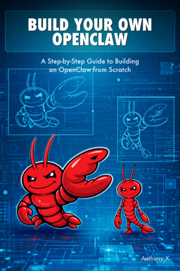

# SlimClaw

SlimClaw is a personal AI agent you can run on your own machine. It connects to Claude or GPT models, gives them tools to act on your behalf, and remembers what matters across conversations. Think of it as a stripped-down, hackable version of [OpenClaw](https://github.com/openclaw/openclaw) — same core ideas, far less complexity.

This is the companion code for the book **Build Your Own OpenClaw** by Anthony X. The book walks you through building SlimClaw from an empty directory to a fully working agent, one chapter at a time. Each chapter introduces one AI concept and one piece of code, so you understand not just *what* the code does but *why* it's designed that way.

You can grab the book here: [Amazon](https://a.co/d/08cmClqL)




## What SlimClaw Can Do

- **Chat through a web UI** — an Express + WebSocket server with a clean browser interface
- **Use tools** — built-in tools for shell commands, file operations, and web fetching
- **Run skills** — markdown-defined behaviors (calculator, weather, GitHub helper, or write your own)
- **Connect to MCP servers** — plug in any [Model Context Protocol](https://modelcontextprotocol.io/) server for extra capabilities
- **Remember things** — long-term memory backed by SQLite FTS5 full-text search and markdown files
- **Spawn sub-agents** — delegate tasks to secondary LLM calls with their own tool access
- **Run on a schedule** — optional heartbeat that wakes the agent at set intervals

## Prerequisites

- **Node.js 20+** and npm
- An **Anthropic API key** (for Claude models) or an **OpenAI API key** (for GPT models)

## Getting Started

Install dependencies:

```bash
npm install
```

Open `slimclaw.json` and add your API key:

```json
{
  "model": "claude-sonnet-4-20250514",
  "apiKey": "sk-ant-..."
}
```

The model name determines which provider to use — names starting with `claude` use Anthropic, names starting with `gpt` or `o1`/`o3`/`o4` use OpenAI. You can also leave `apiKey` empty and set the `ANTHROPIC_API_KEY` or `OPENAI_API_KEY` environment variable instead.

> **Note:** Model names change over time. Check [console.anthropic.com/models](https://console.anthropic.com/models) or [platform.openai.com/docs/models](https://platform.openai.com/docs/models) for the latest available models.

Build and start:

```bash
npm run build
npm start
```

Then open [http://localhost:3000](http://localhost:3000) in your browser and start chatting.

For development with auto-rebuild on file changes:

```bash
npm run dev
```

## Project Structure

```
slimclaw/
├── src/
│   ├── index.ts        # Entry point — wires everything together
│   ├── config.ts       # Loads slimclaw.json, merges defaults
│   ├── agent.ts        # LLM client abstraction (Anthropic + OpenAI)
│   ├── server.ts       # Express + WebSocket server
│   ├── session.ts      # Conversation history (JSONL files)
│   ├── context.ts      # Context window management
│   ├── tools.ts        # Built-in tools (shell, file, web fetch)
│   ├── skills.ts       # Skill loader + hot reload
│   ├── mcp.ts          # MCP server lifecycle
│   ├── memory.ts       # Long-term memory (SQLite FTS5 + markdown)
│   ├── db.ts           # SQLite database setup
│   ├── subagent.ts     # Sub-agent spawning
│   └── heartbeat.ts    # Scheduled wake-ups
├── public/             # Web UI (HTML + CSS + JS)
├── skills/             # Skill definitions (markdown files)
├── memory/             # Memory files (markdown, managed by the agent)
├── slimclaw.json       # Configuration
├── package.json
└── tsconfig.json
```

## Configuration

All settings live in `slimclaw.json`:

| Field | Default | Description |
|-------|---------|-------------|
| `model` | `"gpt-4o"` | Model name (determines provider automatically) |
| `apiKey` | `""` | API key (or use env vars) |
| `maxTokens` | `4096` | Max tokens per response |
| `port` | `3000` | Web server port |
| `host` | `"127.0.0.1"` | Web server host |
| `maxHistoryTurns` | `50` | Conversation turns to keep in context |
| `skillsDir` | `"./skills"` | Path to skill markdown files |
| `memoryDir` | `"./memory"` | Path to memory markdown files |
| `mcp.servers` | `{}` | MCP server definitions |
| `heartbeat.enabled` | `false` | Enable scheduled wake-ups |
| `heartbeat.intervalMinutes` | `30` | Minutes between heartbeats |

## Writing Skills

Skills are markdown files in the `skills/` directory. Each one has YAML front matter and a body that describes the skill's behavior and tools:

```markdown
---
name: calculator
description: Perform mathematical calculations
always: false
---

## Instructions
When the user asks for calculations, use the `calculate` tool.

## Tools
### calculate
Evaluate a mathematical expression.
Parameters:
- expression (string, required): The math expression to evaluate
```

Drop a new `.md` file into `skills/` and SlimClaw picks it up automatically — no restart needed.

## About the Book

**Build Your Own OpenClaw** teaches you to build SlimClaw across 14 chapters, starting with a config loader and ending with a fully featured AI agent. Each chapter adds one layer:

1. Project setup and configuration
2. First LLM API call
3. The conversation loop
4. Streaming and the web UI
5. Tool use
6. The agent loop
7. Sessions and history
8. Context window management
9. Skills
10. MCP integration
11. Long-term memory
12. Heartbeat scheduling
13. Sub-agents
14. What's next

The book is aimed at developers comfortable with Node.js and TypeScript who have basic AI familiarity. You don't need to be an ML expert — just someone who wants to understand how AI agents actually work by building one yourself. You can grab the book here: [Amazon](https://a.co/d/08cmClqL)
